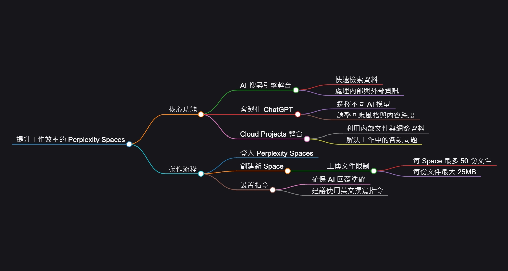

# Perplexity Spaces 实战指南：3个功能让你准点下班

工作群里突然跳出老板的消息："小王这周项目进展如何？"你翻开电脑，几十页会议记录在眼前晃悠。这种时刻，你需要的不是加班翻文件，而是一个能帮你瞬间找到答案的工具。Perplexity Spaces 就是这样一个存在——它把 AI 搜索、文件管理和智能问答三件事合成一个动作，让你在几分钟内就能给出靠谱的回复。

---

## 一、Perplexity Spaces 是什么？

简单来说，它是个会自己找答案的工作助手。

你把会议记录、项目文档扔进去，它不仅能从这堆资料里找信息，还能同时去网上搜相关内容。这意味着什么？就算你上传的文件里没写清楚，它也能从网络上补充答案。

更关键的是，它支持自定义 AI 模型。免费用户用基础版，付费用户可以切换到 GPT-4 这种更强的模型。这种灵活性让它不只是个查资料工具，而是能根据你的工作场景调整"说话风格"——需要正式汇报就严肃点，需要快速沟通就直接点。

---

## 二、三大核心功能拆解

### 1. AI 搜索引擎：不只找文件，还找网络

传统的文档管理工具只能在你上传的文件里搜索。Perplexity Spaces 不一样，它内置了 Perplexity 的 AI 搜索引擎。

比如你问："Tom 上周在合同谈判上做了什么？"它会先扫描你上传的会议记录，然后自动判断是否需要去网上补充信息。如果会议记录里只提了"合同进展顺利"，它可能会从网络上找到相关行业的标准流程，给你一个更完整的答案。

这种双重资料源的设计，解决了一个老问题：工作中的问题往往不是单一文件能回答的，你需要结合内部资料和外部信息。

### 2. 客制化 ChatGPT：让 AI 说你想说的话

Spaces 最聪明的地方在于它的指令系统。

你可以提前设定好回复风格。比如你要回复老板，可以设置指令："回复者是 John，收件人是 Mark，语气正式，重点突出具体进展和数据。"AI 就会按照这个模板生成内容。

**小技巧：指令最好用英文写，尤其是处理中文内容时。**这听起来有点反直觉，但实测下来，英文指令能让 AI 理解得更准确，避免它瞎编。

想体验更强的 AI 能力？👉 [升级 Perplexity Pro，解锁 GPT-4 等高级模型，让工作回复更专业、更高效](https://shaoyumi.com/buy/64)——付费版支持切换多种模型，连 Claude 3.5 Sonnet 都能用。

### 3. Cloud Projects 整合：一次解决多个问题

Cloud Projects 功能让 Spaces 不只是回答单一问题，而是能处理复杂场景。

举个例子：老板问你 Tom 这个月的工作情况，你不仅要回答他做了什么，还得说他做得怎么样，有没有碰到阻碍。传统做法是你得翻三四份文件，然后自己组织语言。

有了 Cloud Projects，你直接问 AI："总结 Tom 十月的工作进展，包括完成项目、遇到的问题和下一步计划。"它会从你上传的所有文件里抽取信息，甚至自动补充一些延伸建议——比如提醒你 Tom 可能需要额外资源支持。

---

## 三、操作流程：5 分钟上手

**第一步：登录并创建 Space**

进入 perplexity.ai，点击左侧的 Spaces，然后新建一个。给它起个名字，最好加个 Emoji——比如用 📊 代表数据分析项目，用 🔥 代表紧急任务。这不是花架子，而是当你有多个 Space 时，图标能让你快速识别。

**第二步：选择 AI 模型**

免费用户默认用基础模型，够用但不够强。如果你是付费用户，建议直接选 GPT-4 或 Claude 3.5 Sonnet，尤其是处理复杂逻辑或需要专业回复的场景。

**第三步:上传文件并设置指令**

每个 Space 最多上传 50 份文件，单个文件限 25MB。这个容量对于文本类会议记录来说完全足够。上传后记得勾选"Web & Space Files"选项，让 AI 能同时搜索文件和网络。

指令部分是关键。比如你要回复老板关于项目进度的问题,指令可以这样写（英文）：

"You are John. Mark is your manager. Summarize Tom's work progress in the past 3 weeks. Include contract signings, sponsorship activities, and marketing efforts. Keep the tone professional and concise."

**第四步:提问并生成回复**

直接问 AI："Mark 想知道 Tom 这三周做了什么。"它会快速从文件里提取信息，生成一份结构清晰的回复。你可以直接复制粘贴,或者再稍微调整一下语气。

**第五步:利用延伸问题**

Spaces 有个很聪明的功能——它会自动生成相关问题。比如你问完 Tom 的工作进展，它可能会提示："Tom 目前遇到的最大挑战是什么？""下一步需要哪些资源支持？"这些延伸问题能帮你预判老板的下一个提问，让你的回复显得更主动、更专业。

---

## 四、实战场景：准点下班不是梦

**场景 1：应对临时汇报**

周五下午 5 点半，你正准备关电脑，老板突然问："这个月市场部的活动效果怎么样？"

你打开 Spaces，扔进去三份活动报告，问 AI："总结十月市场活动的关键数据和效果。"30 秒后，一份包含参与人数、转化率和下一步建议的回复就出来了。复制，发送，关机走人。

**场景 2：团队协作**

你和三个同事负责一个大项目，每周都有海量的会议记录和进度更新。你创建一个 Space，把所有文档扔进去，然后邀请同事加入。大家都能在里面提问，AI 会基于共享文档回答。这样就不用每次都在群里翻聊天记录了。

**场景 3：快速学习新领域**

老板让你研究一个陌生的行业，你对它一无所知。上传几份行业报告到 Spaces，然后问 AI："这个行业的核心商业模式是什么？主要玩家有谁？未来趋势如何？"它会从文档和网络上整合信息，给你一个入门级的知识框架。

---

## 五、为什么 Perplexity Spaces 值得用？

**节省时间**

手动翻文件可能要半小时，用 Spaces 只需几分钟。这不是夸张，而是实测结果。

**避免错误**

AI 的回复基于你上传的文件和网络资料,减少了人为理解偏差或记忆错误。当然，前提是你上传的文件是准确的。

**提升专业度**

延伸问题功能让你能想到自己原本没考虑到的角度。这在回复老板或客户时尤其有用——你不只是回答问题，而是主动提供更多价值。

**强化协作**

团队成员可以共享同一个 Space，所有人都能基于同样的信息源工作。这避免了信息不同步导致的沟通成本。

---

## 六、小技巧和注意事项

1. **指令用英文写**：尤其是处理中文内容时，英文指令能提高准确率。
2. **善用 Emoji 标记**：多个 Space 时，图标能让你快速区分不同项目。
3. **定期清理文件**：50 份文件的上限听起来多，但如果不清理，很快就会满。定期删除过期文档，保持 Space 的效率。
4. **验证关键信息**：AI 很聪明，但不是万能的。涉及重要数据或决策时，最好再人工核对一遍。
5. **邀请功能要慎用**：如果 Space 里有敏感信息，别随便邀请人。虽然方便，但信息安全更重要。

---

## 结语

Perplexity Spaces 不是什么黑科技，它就是把 AI 搜索、文档管理和智能问答三个功能捏在一起，然后做得足够好用。它解决的问题很实际：工作中你经常需要快速找答案，而传统工具要么太慢,要么功能单一。

对于需要频繁回复进度、整理信息或协作的职场人来说，它能省下大量时间。更重要的是，它让你在老板突然提问时不再慌张——因为你知道答案就在那里，只需要几秒钟就能找到。

想要更强大的 AI 能力和更流畅的工作体验？👉 [立即获取 Perplexity Pro 年费成品号，24小时自动发货，365天质保，让 Spaces 发挥最大威力](https://shaoyumi.com/buy/64)。毕竟，工具只是辅助，真正的效率提升来自于你选择了对的工具。

准点下班不是奢望，而是你应得的生活。
